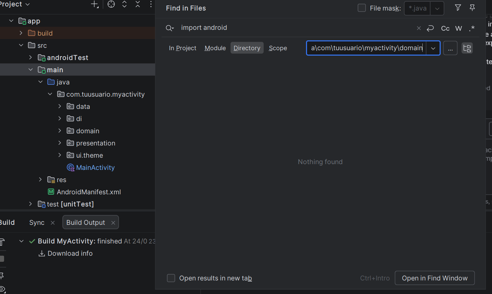
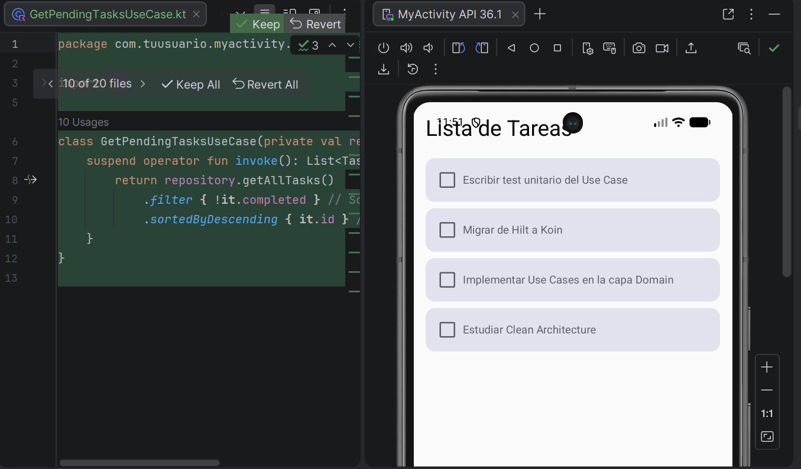
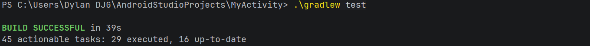

#  Unidad 3: Arquitectura de Aplicaciones Móviles

Este proyecto consiste en el desarrollo de una aplicación Android aplicando el patrón **Clean Architecture**, garantizando la separación de responsabilidades, escalabilidad y facilidad de mantenimiento.

Además, se implementa **inyección de dependencias con Koin**, y pruebas unitarias para validar la lógica de negocio.

---

#  Arquitectura Clean Architecture

El proyecto está estructurado en tres capas principales:

##  1. Capa Domain (Dominio)

Contiene la lógica de negocio pura, sin dependencias externas.

Incluye:

* Modelos (Task)
* Interfaces de repositorio (TaskRepository)
* Casos de uso (GetPendingTasksUseCase)

 Características:

* No depende del SDK de Android
* Código en Kotlin puro
* Es la capa más importante del sistema

---

##  2. Capa Data

Encargada de la implementación de los repositorios definidos en domain.

Incluye:

* Implementación: InMemoryTaskRepository

 Función:

* Proveer datos al dominio
* Simular fuente de datos en memoria

---

##  3. Capa Presentation

Gestiona la interacción con el usuario.

Incluye:

* ViewModel (TaskViewModel)
* UI de la aplicación

 Función:

* Mostrar datos
* Conectar la UI con la lógica de negocio

---

# Inyección de Dependencias

Se implementa **Koin** para gestionar las dependencias del proyecto.

 Beneficios:

* Desacoplamiento de componentes
* Facilita testing
* Mejora mantenibilidad

---


##  Checkpoint 1: Independencia de la capa Domain

Se verificó que la carpeta `domain` no contiene imports del tipo:

```text id="c1"
import android
```

Esto garantiza que el dominio es independiente del framework.

 Evidencia:



---

##  Checkpoint 2: Ejecución de la aplicación

La aplicación se ejecuta correctamente mostrando únicamente las tareas pendientes.

 Lógica aplicada:

* Se filtran tareas con `completed = false`
* Se muestran 4 tareas de un total de 5

 Evidencia:



---

##  Checkpoint 3: Tests unitarios

Se implementaron pruebas unitarias para validar el caso de uso:

* GetPendingTasksUseCase

Ejecución:

```text id="c2"
./gradlew test
```

Resultado:

* Todos los tests pasan correctamente

Evidencia:



---

#  Tecnologías utilizadas

* Kotlin
* Android Studio
* Koin
* JUnit

---

#  Estructura del Proyecto

```text id="c3"
com.tuusuario.myactivity
│
├── data
│   └── repository
│
├── domain
│   ├── model
│   ├── repository
│   └── usecase
│
└── presentation
    └── viewmodel
```


#  Commits realizados

El repositorio refleja una evolución progresiva del proyecto:

* Implementa caso de uso para filtrar tareas pendientes
* Integra ViewModel con la UI
* Agrega pruebas unitarias
* Agrega evidencias de ejecución

Los commits siguen una estructura descriptiva en modo imperativo.

---

# Ejecución del proyecto

1. Clonar repositorio
2. Abrir en Android Studio
3. Ejecutar la aplicación

Para tests:

```text id="c4"
./gradlew test
```

